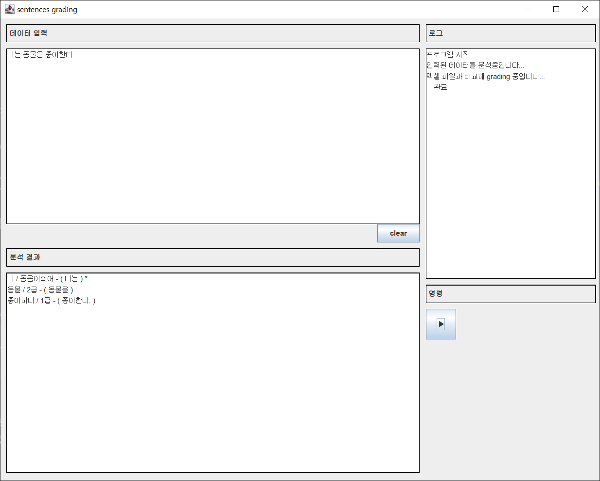

# WordGrader

### :pushpin: 프로젝트 소개 
(1)
>문단을 입력값으로 집어넣으면 어절 마다 한글 단어의 원본으로 변형시키고 변형시킨 결과로 엑셀 등급표와 비교해서 있으면 해당되는 등급을 표시하고, 없으면 출력하지 않는 프로그램. 단, 동음이의어로써 엑셀 등급표에 겹치는 단어를 구분하려고 01, 02, 03으로 나누어 져 있는 경우가 있다. 이런 경우는 문맥에 따라서 직접 판단하고 해당하는 등급을 찾아 넣어야 한다.

(2)
>한국어 교육에 종사하는 지인이 부탁해서 API를 활용해 만들어 본 프로그램이고 단지 업무의 자동화를 위해서 만들었다.

(3)
>실행 프로그램을 만들어본 경험은 없고 처음이다. 최대한 모든 환경에서 실행 가능하도록 만드려고 해서 최종적으로 exe형식의 파일로 완성했다.

* 과정 예시  
`나는 동물을 좋아한다.`  
`나는/사과를/좋아한다.`  
`나는 -> 나 / 동물을 -> 동물 / 좋아한다 -> 좋다`  
`나는 -> 나 -> 1급 / 동물을 -> 동물-> 2급 / 좋아한다 -> 좋다 -> 1급`  

* 사용 api  
`(1) 꼬꼬마 세종 말뭉치 활용 시스템 (형태소 분석기)`  
`(2) Apachi POI (엑셀 파일 읽기)`  

  
### :pushpin: 느낀점
한국어를 분석한다는 부분이 비교하자면 영어와 다르게 단어가 변형되어 사용되기 때문에 빠른 시일 내에 알고리즘을 완성 하는게 불가능에 가깝다고 생각했지만 이미 만들어져있는 형태소 분석 API를 찾게 돼어서 생각보다 운좋게 만들게 된 프로그램이다.  

특정 목적을 가지고 만들어진 API를 처음 사용해 봤으며, 클래스와 메소드에 대한 구체적인 설명이 없어서 직접 메소드의 반환값을 콘솔에 출력해보면서 분석하는 과정이 필요 했다.  

또한 보수를 받고 만든 것이 아니지만 누군가가 필요한 부분에 대해서 책임을 가지고 프로그램으로 만들어준 것이 처음이므로 느끼는 바가 컸다.
